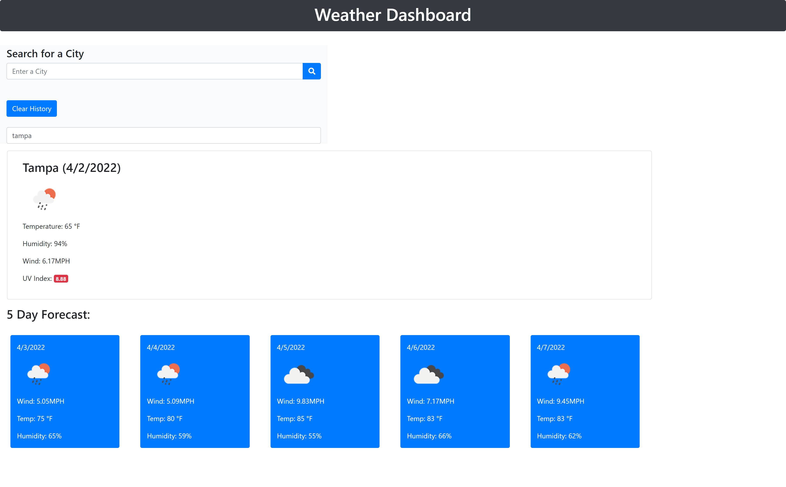

# Weather-dashboard
# <Dean-Ketchmark's-Weather-Dashboard>

## Description
This is my Weather dashboard. When you search for a city you are provided with the current weather there and also a 5 day forecast. you are provided with the temperature, wind speed and humidity. I used a api with Openweather.org with onecall and also current weather conditions.

## Installation

Click on the following link to visit.
https://deank24.github.io/Weather-dashboard/

## Usage

Provide instructions and examples for use. Include screenshots as needed.
  

# Technology used
Openweather.org
Bootstrap

## Credits
I was the only person that worked on this project.
https://github.com/DeanK24